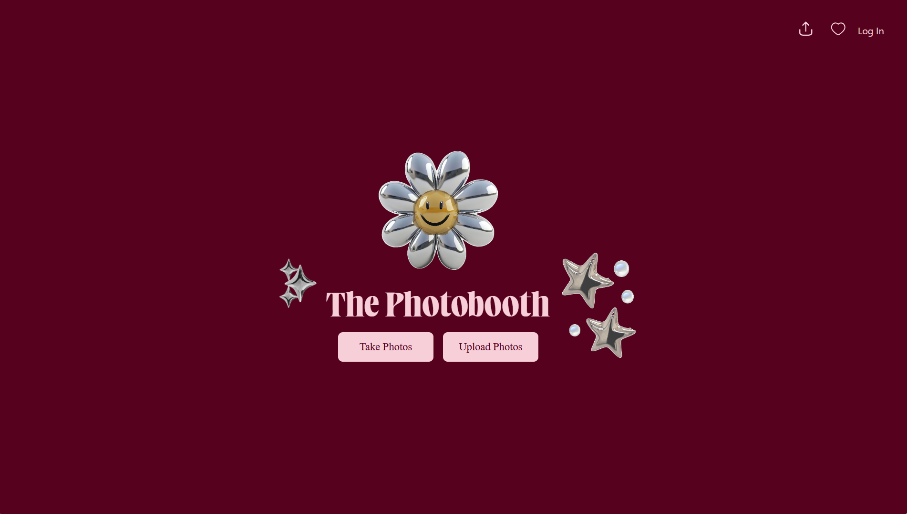

# The Photobooth

Try out photobooth! Link to our website: https://awksrj.github.io/web-photobooth-0




## Overview
The Photobooth brings the classic photobooth experience to the browser. Users can capture images from their webcam, upload photos from their device, apply filters, add personalized messages, download or share the results as PNGs, and store captured photostrips in a personal gallery.


## Key Features
- Webcam photo capture with live preview
- Upload photo from your device
- Real-time image filters 
- Custom text for personalized messages
- Assemble photos into a photostrip layout
- Downloadable high-resolution PNG export
- Built-in share buttons for social media or messaging
- Personal gallery to store and view captured images 
## Tech Stack
- **Frontend:** React, TypeScript, CSS
- **Backend:** Node.js, TypeScript
- **Database:** MongoDB
- **Authentication:** Firebase
- **Camera & Export**: navigator.mediaDevices, html2canvas, jsPDF
## Getting Started

### Prerequisites

- **Node.js** (v14 or higher)  
- **npm** (v6 or higher) 

### Installation

1. **Clone the repository**  
   ```bash
   git clone https://github.com/awksrj/web-photobooth-0.git
   cd web-photobooth-0

2. **Install dependencies**  
    ```bash
    npm install

3. **Set up environment variables:** 
- Create a `.env` file in the `backend` directory and add the following:
   ```dotenv
   MONGO_URI=your_mongodb_connection_string
   ```
   
-  Create a `.env` file in the `frontend` directory and add the following:
   ```dotenv
    REACT_APP_FIREBASE_API_KEY=your-firebase-api-key 
    REACT_APP_FIREBASE_AUTH_DOMAIN=your-firebase-auth-domain
    REACT_APP_FIREBASE_PROJECT_ID=your-firebase-project-id 
    REACT_APP_FIREBASE_STORAGE_BUCKET=your-firebase-storage-bucket  
    REACT_APP_FIREBASE_MESSAGING_SENDER_ID=your-firebase-messaging-sender-id 
    REACT_APP_FIREBASE_APP_ID=your-firebase-app-id
    REACT_APP_FIREBASE_MEASUREMENT_ID=your-firebase-measurement-id
   ```

### Running the Application

1. **Start both backend and frontend servers:**

   ```bash
   npm run start
   ```

2. **Access the application:**
   
   Open your browser and navigate to `http://localhost:3000`

